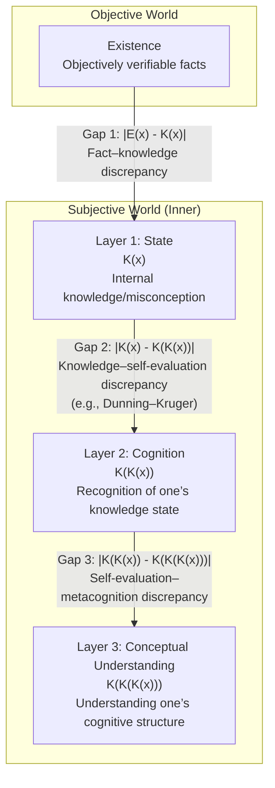

# A Study on the Hierarchical Structure of Knowledge and the Cognition of Ignorance — Commentary

Created By: Kunihiro Sugiyama
Created: 2025-09-06 13:51 (JST)
Last Edited Time: 2025-09-06 14:07 (JST)
URL: https://github.com/KunihiroS/study_papers/blob/main/A_Study_on_the_Hierarchical_Structure_of_Knowledge_and_the_Cognition_of_Ignorance/A_Study_on_the_Hierarchical_Structure_of_Knowledge_and_the_Cognition_of_Ignorance.pdf
Tags: paper

Japanese version: A_Study_on_the_Hierarchical_Structure_of_Knowledge_and_the_Cognition_of_Ignorance_Commentary.ja.md

# Summary

This commentary proposes a new theoretical model that integrates the multi-layered structure of human knowledge with the metacognitive process of recognizing one’s own ignorance. The model is built upon four elements—Existence, State, Cognition, and Conceptual Understanding—and represents knowledge and ignorance along a continuous value in [-1, 1]. It aims to cover three under-addressed facets in prior work: (1) the gap between subjectivity and objectivity, (2) the hierarchical (multi-level) structure of internal knowledge, and (3) the continuity (gradation) of knowledge. In particular, it offers a structural framework to analyze the discrepancy between objective facts (Existence) and one’s subjective knowledge (State), as well as the inability to accurately recognize one’s own knowledge level (e.g., the Dunning–Kruger effect), thereby deepening our understanding of the essence of knowledge and the cognition of ignorance.

# Briefing

This work constructs and proposes a comprehensive theoretical model to elucidate the complex structure of human knowledge and the mechanism of metacognition (the “awareness of ignorance”), which is crucial to learning and decision-making. Below are the background, details of the proposed model, and its scholarly significance.

### 1. Background and Problem Statement

Human knowledge cannot be reduced to a binary of “knowing vs. not knowing.” Degrees of certainty vary; sometimes we hold incorrect knowledge; sometimes we are aware of what we do not know. Understanding such multi-layeredness and ambiguity is important across education, AI, and decision science.
This work points out that prior research has not integrally addressed the following three aspects:

1. Subjectivity–Objectivity Gap: A discrepancy often arises between objective facts that exist independently and the content individuals subjectively “believe they know.” This gap underlies misunderstanding and poor judgment.
2. Hierarchical Structure of Internal Knowledge: Knowledge is not a single layer; it includes, for example, “having knowledge of something” (first layer) and “recognizing that state oneself” (second layer, i.e., metacognition).
3. Continuity of Knowledge: Knowledge should be seen as a spectrum from complete understanding to complete misunderstanding, not as digital 0/1.

To address these issues, this study proposes a new model by integrating insights from epistemology, metacognition, and knowledge representation.

### 2. Proposed Model: Four Layers and Continuous Representation

The core of the model consists of four elements: Existence, State, Cognition, and Conceptual Understanding.

- Layer 0: Existence
  - Definition: Objective facts and truths verifiable independently of subjectivity; akin to Kant’s “thing-in-itself.” Serves as the absolute reference point against which knowledge is evaluated, irrespective of any individual’s recognition.
  - Role: Functions as the “answer key” to measure the accuracy of subjective knowledge.
- Layer 1: State — K(x)
  - Definition: The internally held knowledge state about a target x. This refers to a latent knowledge level, regardless of the person’s conscious awareness.
  - Representation: Continuous value in [-1, 1].
    - 1: Completely correct knowledge about the target.
    - 0: Knows nothing (pure ignorance).
    - -1: Holds completely incorrect knowledge (misconception).
- Layer 2: Cognition — K(K(x))
  - Definition: The metacognitive level of how accurately one recognizes one’s own State (Layer 1)—that is, the ability to grasp “what I know and what I do not know.”
  - Representation: Continuous value in [-1, 1].
    - 1: Accurately recognizes one’s own knowledge state (e.g., being aware that “I don’t know”).
    - 0: Unaware of one’s knowledge state (ignorance of ignorance).
    - -1: Misrecognizes one’s own knowledge state (e.g., being wrong yet utterly convinced one is right). This is where the Dunning–Kruger effect manifests strongly.
- Layer 3: Conceptual Understanding — K(K(K(x)))
  - Definition: Understanding the structure of Cognition itself—i.e., a higher-order metacognitive capacity to grasp one’s own cognitive processes and thinking habits.
  - Representation: Continuous value in [-1, 1].
    - 1: Understands one’s cognitive mechanisms accurately.
    - 0: Unaware of one’s cognitive mechanisms.
    - -1: Holds erroneous beliefs about one’s cognitive mechanisms.

### 3. Analyzing Gaps between Subject and Object

Using this model, various kinds of ignorance and misunderstanding can be quantitatively analyzed as gaps between layers:

- Gap between Existence and State: |E(x) - K(x)| — the discrepancy between objective facts and subjective knowledge. The larger it is, the less accurate one’s knowledge.
- Gap between State and Cognition: |K(x) - K(K(x))| — the discrepancy between real knowledge level and self-evaluation; large values indicate over- or underestimation.
- Gap between Cognition and Conceptual Understanding: |K(K(x)) - K(K(K(x)))| — the discrepancy between self-evaluation and higher-order metacognition.

### 4. Scholarly Contributions

This work integrates scattered research on knowledge and ignorance, contributing in three ways:

1. Comprehensive Framework: Unifies the three key aspects—subjectivity vs. objectivity, hierarchical structure, and continuity—into a single model to capture the whole picture of knowledge and ignorance.
2. Structuring Ignorance: Enables multi-layer classification and analysis of “not knowing,” beyond mere lack of knowledge (State=0), including “not knowing that one does not know” (Cognition=0) and “believing one is right while being wrong” (State=-1, Cognition=-1).
3. Applicability: The model can be used as an analytical tool for diagnosing individual learning processes, designing effective pedagogy, and improving decision quality in organizations.

# FAQ

Q1: What does “Existence” refer to in this model?
A1: Existence denotes objective facts and truths independent of personal opinions or beliefs (e.g., “Earth orbits the Sun,” “1+1=2”). In this model, it serves as the absolute reference point—the “answer key”—to measure how accurate one’s knowledge is.

Q2: Why represent knowledge on a continuous scale from -1 to 1?
A2: The binary framing of “know/don’t know” cannot capture the complexity of real knowledge. Continuous representation provides advantages:
- Degree of knowledge: It captures depth/confidence (e.g., “know a little,” “almost fully understand”).
- Misconceptions: Negative values separate “simply not knowing (0)” from “actively believing something false (-1),” which is crucial in learning.
- Modeling ambiguity: Real-world knowledge includes uncertainty; continuity models it naturally.

Q3: How does the Dunning–Kruger effect appear in this model?
A3: It corresponds to a large gap between State and Cognition: low actual knowledge or skill on a task (K(x) ≈ 0 or negative) combined with high self-assessed understanding (K(K(x)) ≈ 1). The magnitude |K(x) - K(K(x))| captures this structurally.

Q4: What is the difference between Cognition and Conceptual Understanding?
A4: Both concern metacognition at different levels.
- Cognition: the ability to recognize whether one knows a specific piece of knowledge (State). Example: “I do not know calculus.”
- Conceptual Understanding: higher-order metacognition about one’s learning/thinking processes. Example: “When learning new concepts, I start from concrete examples,” or “Under pressure I tend to overestimate my knowledge.”

Q5: How is this useful in practice?
A5: Potential applications include:
- Education: diagnosing whether a learner’s stumbling block is lack of knowledge (State) or unawareness of ignorance (Cognition), enabling tailored instruction.
- Talent development: designing training programs that help employees accurately assess skill levels and improve effectively.
- Decision-making: helping experts/leaders recognize limits and biases to make more cautious, higher-quality decisions.

# For easy understanding

This work tackles familiar yet profound questions: What does it mean to “truly know” something? How do we become aware that “we do not know”?

### Four Levels of Knowledge: A Map Metaphor

Imagine your knowledge as a “world map.”

- Level 0: Actual terrain (Existence)
  Objective reality that does not change regardless of our beliefs—mountains, rivers, etc.
- Level 1: The map in your head (State)
  Your internal knowledge. Parts may be correct; some are blank (ignorance); some are drawn wrongly (misconceptions).
- Level 2: Knowing which parts of your map are reliable (Cognition)
  The capacity to assess the accuracy/uncertainty of your map. Without it, one confidently takes wrong turns—the Dunning–Kruger effect.
- Level 3: Becoming good at drawing maps (Conceptual Understanding)
  Understanding how to learn/draw better maps—your learning strategies and thinking habits.

### In short

Becoming wiser involves three steps: not only filling in your mental map, but also recognizing its limits and, further, understanding how you learn itself. This model provides a new yardstick for why people cling to errors and how to learn effectively.

# Mermaid Diagrams

Below are Mermaid diagrams visualizing the paper’s content.

## Concept and Structure

Figure 1: Four-layer knowledge model and gaps between layers.



## Sequence Timeline

Figure 2: A learning process that transitions from misplaced confidence to awareness of ignorance and, finally, accurate knowledge and self-recognition.

```mermaid
sequenceDiagram
    participant Subject as Individual
    participant World as Objective World (Facts)

    Note over Subject: Before learning: misplaced confidence
    Subject->>Subject: State = -0.8 (misconception)\nCognition = 0.9 (confident)

    World->>Subject: Provide new information/feedback

    Note over Subject: Confusion stage: beginning to notice one’s errors
    Subject->>Subject: State = -0.2 (misconceptions remain)\nCognition = -0.5 (loss of confidence)

    Subject->>World: Ask questions; learn actively
    World-->>Subject: Provide accurate information

    Note over Subject: Awareness of ignorance and reconstruction of knowledge
    Subject->>Subject: State = 0.1 (aware of ignorance)\nCognition = 0.9 (knows that one does not know)

    Subject->>World: Further exploration and learning
    World-->>Subject: Provide deep knowledge

    Note over Subject: After learning: accurate knowledge and self-recognition
    Subject->>Subject: State = 0.9 (accurate knowledge)\nCognition = 0.9 (aware of accurate understanding)
```
