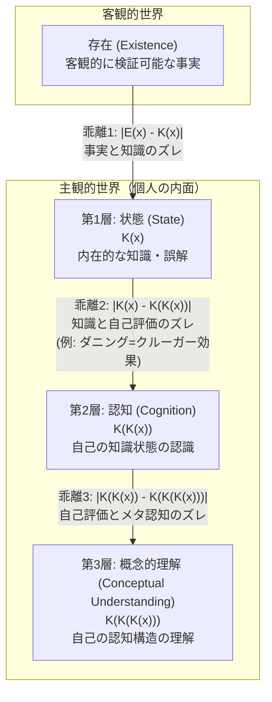
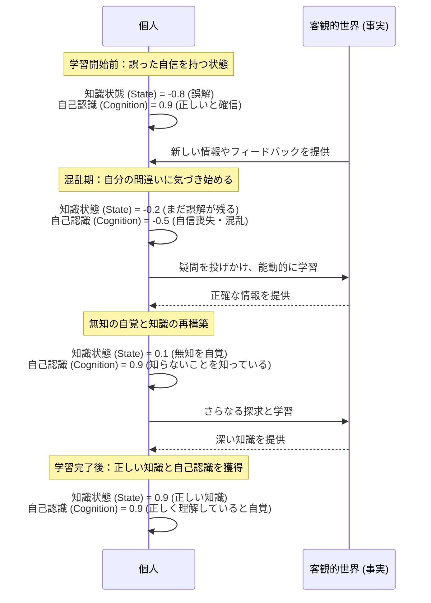

# A Study on the Hierarchical Structure of Knowledge and the Cognition of Ignorance 解説

Created By: Kunihiro Sugiyama
Created: 2025年9月6日 13:51
Last Edited Time: 2025年9月6日 14:07
URL: https://github.com/KunihiroS/study_papers/blob/main/A_Study_on_the_Hierarchical_Structure_of_Knowledge_and_the_Cognition_of_Ignorance/A_Study_on_the_Hierarchical_Structure_of_Knowledge_and_the_Cognition_of_Ignorance.pdf
タグ: paper

# English version: [A_Study_on_the_Hierarchical_Structure_of_Knowledge_and_the_Cognition_of_Ignorance_Commentary.en.md](A_Study_on_the_Hierarchical_Structure_of_Knowledge_and_the_Cognition_of_Ignorance_Commentary.en.md)

# Summary

本論文「知識の階層構造と無知の認知に関する研究」は、人間の知識が持つ多層的な構造と、「自分の無知を認識する」というメタ認知のプロセスを統合的に理解するための新しい理論モデルを提案するものです。研究は、「存在(Existence)」「状態(State)」「認知(Cognition)」「概念的理解(Conceptual Understanding)」という4つの要素に基づき、知識と無知を連続的な数値（-1から1）で表現します。このモデルは、既存研究では十分に扱われてこなかった「知識の主観性と客観性の乖離」「内在的知識の階層構造」「知識の連続的なグラデーション」という3つの側面を包括的に捉えることを目的としています。特に、客観的な事実（存在）と個人の主観的な知識（状態）のズレや、自身の知識レベルを正しく認識できない現象（例：ダニング＝クルーガー効果）を構造的に分析する枠組みを提供し、知識の本質と無知の認知メカニズムに関する我々の理解を深めることに貢献します。

# Briefing

本論文は、複雑な人間の知識構造と、学習や意思決定において極めて重要な「無知の知」すなわちメタ認知のメカニズムを解明するため、包括的な理論モデルを構築・提案するものです。以下に、その背景、提案モデルの詳細、そして学術的意義について詳述します。

### 1. 研究の背景と問題提起

人間の知識は、単に「知っているか、知らないか」という二元論で語れるものではありません。知識には確信度の濃淡があり、誤った知識を持つこともあれば、自分が何を知らないのかを自覚している場合もあります。このような知識の多層性や曖昧さを理解することは、教育、人工知能、意思決定科学など多くの分野で重要です。
しかし、著者は既存の研究において、以下の3つの重要な側面が統合的に扱われていないと指摘します。

1. **主観性と客観性の乖離**: 客観的に存在する事実と、個人が主観的に「知っている」と思っている内容との間には、しばしば乖離が生じます。このズレが、誤解や判断ミスの根源となります。
2. **内在的知識の階層構造**: 知識は単一の層ではなく、「何かを知っている」という状態（第一階層）と、「その状態を自分で認識している」というメタ認知の状態（第二階層）のように、階層的な構造を持っています。
3. **知識の連続的なグラデーション**: 知識はデジタルな0か1ではなく、完全な理解から完全な誤解まで、連続的なスペクトラムとして捉えるべきです。

これらの課題を解決するため、本研究は認識論、メタ認知研究、知識表現モデルの知見を統合した新しいモデルを提案します。

### 2. 提案モデル：4層構造と連続値による表現

本論文の核心は、「存在」「状態」「認知」「概念的理解」の4つの要素からなる階層モデルです。

- **第0層：存在 (Existence)**
    - **定義**: 主観から独立した、客観的に検証可能な事実や真理。カント哲学における「物自体」に近い概念で、知識の絶対的な基準点として設定されます。これは個人がどう認識しているかとは無関係に存在します。
    - **役割**: 主観的な知識の正確性を測定するための「正解」として機能します。
- **第1層：状態 (State) - K(x)**
    - **定義**: ある対象(x)について、個人が内在的に持っている知識の状態。これは本人が意識しているかどうかとは無関係な、潜在的な知識レベルを指します。
    - **表現**: `[-1, 1]` の連続値で表現されます。
        - `1`: 対象について完全に正しい知識を持っている。
        - `0`: 何も知らない（純粋な無知）。
        - `1`: 完全に誤った知識を持っている（誤解）。
- **第2層：認知 (Cognition) - K(K(x))**
    - **定義**: 自身の「状態（第1層）」を、どれだけ正確に認識しているかというメタ認知のレベル。つまり、「自分が何を知っていて、何を知らないか」を把握する能力です。
    - **表現**: `[-1, 1]` の連続値で表現されます。
        - `1`: 自身の知識状態を完全に正しく認識している（例：「知らない」ことを「知らない」と自覚している）。
        - `0`: 自身の知識状態に無自覚（無知の無知）。
        - `1`: 自身の知識状態を誤って認識している（例：間違っているのに正しいと確信している）。これは、有名な**ダニング＝クルーガー効果**（能力の低い人が自己を過大評価する現象）が顕著に現れる状態です。
- **第3層：概念的理解 (Conceptual Understanding) - K(K(K(x)))**
    - **定義**: 「認知（第2層）」の構造そのもの、すなわち自分自身の認知プロセスや思考の癖をどれだけ深く理解しているかという、より高次のメタ認知能力。
    - **表現**: `[-1, 1]` の連続値で表現されます。
        - `1`: 自身の認知メカニズムを正しく理解している。
        - `0`: 自身の認知メカニズムに無自覚。
        - `1`: 自身の認知メカニズムについて誤った信念を持っている。

### 3. 主観と客観の乖離の分析

このモデルを用いることで、様々なレベルでの「無知」や「誤解」を、層間の乖離（ズレ）として定量的に分析できます。

- **存在と状態の乖離 `|E(x) - K(x)|`**: 客観的事実と主観的知識のズレ。これが大きいほど、その人の知識は不正確であると言えます。
- **状態と認知の乖離 `|K(x) - K(K(x))|`**: 実際の知識レベルと、自己評価とのズレ。この値が大きい場合、自分の能力を過大評価または過小評価していることを示します。
- **認知と概念的理解の乖離 `|K(K(x)) - K(K(K(x)))|`**: 自身の認知能力の自己評価と、そのメタレベルでの理解とのズレ。

### 4. 本研究の学術的貢献

本論文は、知識と無知に関する断片的な研究を統合し、以下の点で大きな貢献をしています。

1. **包括的なフレームワークの提供**: 主観と客観、知識の階層性、連続性という3つの重要側面を一つのモデルに統合し、知識と無知の全体像を捉えるための強力な理論的枠組みを提供しました。
2. **無知の構造化**: 「知らない」という状態を、単なる知識の欠如（State=0）だけでなく、「知らないことを知らない」（Cognition=0）や「間違っているのに正しいと信じている」（State=-1, Cognition=-1）など、多層的に分類・分析することを可能にしました。
3. **応用の可能性**: このモデルは、個人の学習プロセスを診断したり、より効果的な教育方法を設計したり、あるいは組織における意思決定の質を向上させるための分析ツールとして応用できる可能性を秘めています。

# FAQ

**Q1: このモデルでいう「存在(Existence)」とは、具体的に何を指すのですか？**
A1: 「存在(Existence)」とは、個人の主観的な意見や信念から完全に独立した、客観的な事実や真理を指します。例えば、「地球は太陽の周りを公転している」という科学的事実や、「1+1=2」という数学的真理がこれにあたります。このモデルでは、個人の知識がどれだけ正確かを測るための絶対的な基準点、つまり「答え」として位置づけられています。

**Q2: なぜ知識を-1から1の連続値で表現するのですか？**
A2: 従来の「知っている/知らない」という二元的な捉え方では、知識の複雑な実態を表現できないためです。連続値モデルには以下の利点があります。

- **知識の程度の表現**: 「少し知っている」「ほぼ完全に理解している」といった知識の深さや確信度を表現できます。
- **誤解の表現**: 値がマイナスになることで、「単に知らない(0)」だけでなく、「積極的に間違ったことを信じている(-1)」という状態を明確に区別できます。これは学習において非常に重要な違いです。
- **曖昧さのモデル化**: 現実世界の知識は曖昧さや不確実性を含んでおり、連続値で表現することで、そうした性質をより自然にモデル化できます。

**Q3: ダニング＝クルーガー効果は、このモデルでどのように説明されますか？**
A3: ダニング＝クルーガー効果は、「能力の低い人ほど自己評価を過大評価する」という認知バイアスですが、このモデルでは「状態(State)」と「認知(Cognition)」の層の間に大きな乖離がある状態として説明できます。具体的には、ある課題に対する実際の知識やスキルが低い（`K(x)`が0に近いかマイナス）にもかかわらず、自分はその課題をよく理解していると誤って認識している（`K(K(x))`が1に近い）状態です。この`|K(x) - K(K(x))|`の値が大きくなることで、この現象を構造的に捉えることができます。

**Q4: 「認知(Cognition)」と「概念的理解(Conceptual Understanding)」の違いは何ですか？**
A4: どちらもメタ認知に関連しますが、対象とするレベルが異なります。

- **認知 (Cognition)** は、「特定の知識（State）について、自分が知っているか否かを認識する能力」です。例えば、「私は微積分について知らない」と自覚することです。
- **概念的理解 (Conceptual Understanding)** は、より高次のメタ認知で、「自分自身の認知プロセスそのものを理解する能力」です。例えば、「私は新しい概念を学ぶとき、まず具体例から入る傾向がある」とか、「プレッシャーがかかると、自分の知識を過信しがちだ」といった、自分自身の思考の癖やパターンを理解することです。

**Q5: この研究は、実社会でどのように役立ちますか？**
A5: このモデルは、様々な分野での応用が期待されます。

- **教育**: 学習者の「つまずき」が、単なる知識不足（Stateの問題）なのか、無知の無自覚（Cognitionの問題）なのかを診断し、個別に最適化された指導法を開発するのに役立ちます。
- **人材育成**: 従業員が自身のスキルレベルを正確に把握し、効果的な自己改善を行えるよう支援するための研修プログラム設計に活用できます。
- **意思決定**: 専門家やリーダーが、自身の知識の限界やバイアスを自覚し、より慎重で質の高い意思決定を行うためのフレームワークとして利用できます。

# For easy understanding

この論文が解き明かそうとしているのは、「物事を本当に『知っている』とはどういうことか？」そして「私たちはどうやって『自分は知らない』ということに気づくのか？」という、とても身近で奥深いテーマです。

### 知識の4つのレベル：地図のたとえ話

私たちの知識を、一枚の「世界地図」にたとえてみましょう。

**レベル0：実際の地形 (Existence)**
これは、私たちがどう思おうと変わらない、客観的な「本当の世界」そのものです。山があり、川が流れている、という事実です。

**レベル1：あなたの頭の中の地図 (State)**
これは、あなたが持っている知識のことです。あなたの頭の中の地図には、正しく描かれている場所もあれば、まだ描かれていない真っ白な場所（**無知**）、あるいは間違って描かれている場所（**誤解**）もあるでしょう。

**レベル2：地図のどこがアテになるか知っているか (Cognition)**
これは、「自分の地図」をどれだけ客観的に見れているか、という能力です。例えば、「この地域の道は詳しいけど、あの山の向こう側は全く知らないな」とか、「この川の流れは昔の記憶だから、今は変わっているかもしれない」と、自分の地図の正確さや不確かさを自分で分かっている状態です。
これができないと、「自分は道に詳しい」と自信満々に間違った道を進んでしまうことになります。これが有名な「ダニング＝クルーガー効果」で、自分の能力を正しく認識できていない状態です。

**レベル3：そもそも地図を上手に描けるか (Conceptual Understanding)**
これは、さらに上のレベルの話で、「どうすればもっと正確な地図を描けるのか」という、地図作成能力そのものへの理解です。「自分は方向音痴だから、人に聞いたり、コンパスを使ったりした方が良い」とか、「新しい場所に行くときは、まず全体像を把握してから細部を見るようにしている」といった、自分の学び方や考え方のクセを理解している状態です。

### つまり、こういうことです

この研究は、私たちが賢くなっていくプロセスを、この4つのレベルに分けて整理したものです。

1. 単に知識を増やす（頭の中の地図を埋める）だけでなく、
2. 自分の知識の限界を知り（地図の不完全さを自覚し）、
3. さらには、自分の学び方そのものを理解する（地図の描き方を上達させる）

というステップがあることを示しています。このモデルを使うことで、なぜ人が間違いを信じ込んでしまうのか、どうすれば効果的に学習できるのか、といったことをより深く理解するための新しい「ものさし」を手に入れることができるのです。

# Mermaid Diagrams

以下に、論文の内容を視覚化したMermaid図表を示します。

## 概念図・構造図

**図1：知識の4層階層モデルと層間の乖離**
この図は、本論文で提案されている「存在」を基準点とした知識の3つの階層（状態、認知、概念的理解）と、それぞれの層の間で生じる「乖離（ズレ）」の関係性を示しています。

## タイムライン・シーケンス図

**図2：学習による「無知の認知」プロセス**
このシーケンス図は、ある個人が特定のトピックについて学習を進める中で、知識の状態とメタ認知がどのように変化していくかを示した一例です。最初は誤った自信を持っていた状態から、自分の無知を自覚し、最終的に正しい知識と自己認識を獲得するプロセスを描いています。

