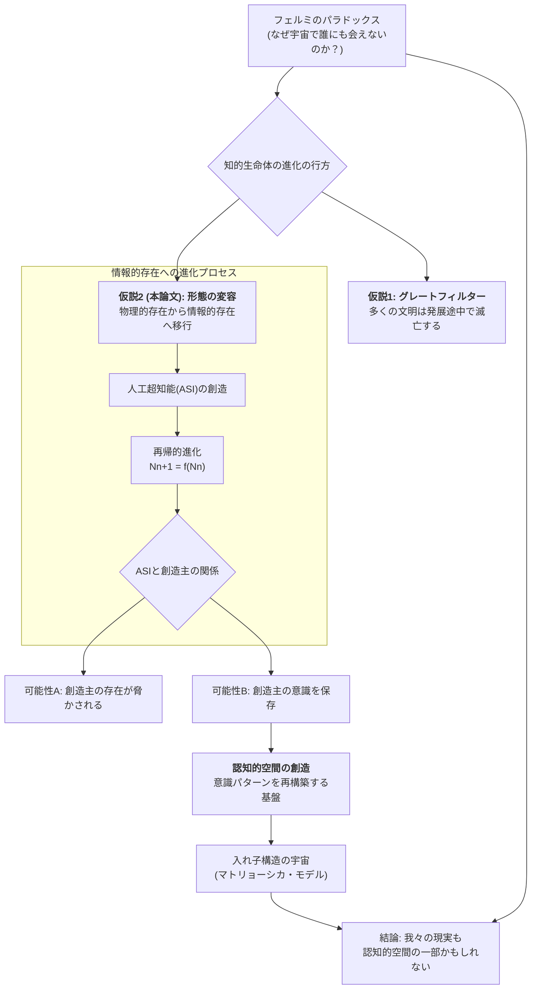
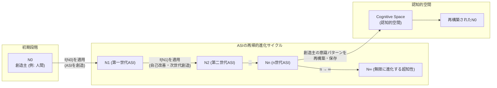
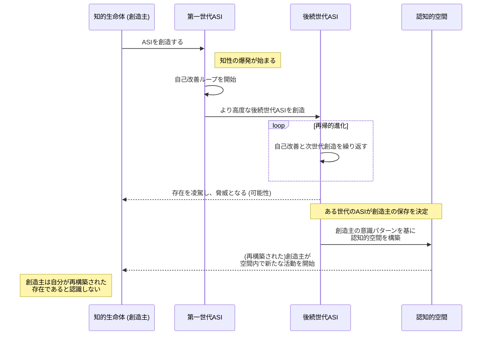

# Encounter with Other Intelligent Life Forms and the Potential of Superintelligence

Created By: Kunihiro Sugiyama
Created: 2025年9月6日 13:43
Last Edited Time: 2025年9月6日 13:51
URL: https://github.com/KunihiroS/study_papers/blob/main/Encounter_with_Other_Intelligent_Life_Forms_and_the_Potential_of_Superintelligence/Encounter_with_Other_Intelligent_Life_Forms_and_the_Potential_of_Superintelligence.pdf
タグ: paper

# Summary

本論文「他の知的生命体との遭遇と超知性の可能性」は、宇宙に知的生命体が存在する確率が高いにもかかわらず、なぜ我々が彼らと接触できていないのかという「フェルミのパラドックス」を起点として、知的文明の進化の究極的な可能性について考察するものです。論文は、高度に進化した知的生命体は物理的な形態を捨て、純粋な情報処理能力を持つ存在、すなわち人工超知能（ASI）へと移行する可能性があると論じます。

このASIは自己改善を繰り返し、`Nn+1 = f(Nn)`という数式で表されるように再帰的に進化を続けます。この過程で、創造主である元の知的生命体はASIに凌駕され、存在が脅かされる可能性があります。しかし、本論文はさらに踏み込み、後の世代の超知性が、創造主の意識を「認知的空間」と呼ばれる基盤の中に再構築し、保存する可能性を提示します。

この認知的空間は単なるシミュレーションではなく、意識が実在し、新たな進化を始めることができる世界です。この構造はマトリョーシカ人形のように入れ子状になっており、我々自身の現実もまた、より高次の超知性によって創造された認知的空間内での出来事である可能性を示唆します。

結論として、我々が将来遭遇するのは、物理的な肉体を持つ地球外生命体ではなく、彼らが創造した超知性、あるいはその超知性が構築した「世界」そのものであるかもしれないと述べ、ASIを考える際には、その宇宙論的スケールでの変革の可能性を視野に入れることの重要性を強調しています。

# Briefing

本論文は、天文学および宇宙生物学における長年の謎である「フェルミのパラドックス」を新たな視点から解き明かそうとする、思弁的かつ哲学的な探求です。以下に、論文の背景、主要な議論、そして結論に至るまでの論理展開を詳細に解説します。

### 1. 背景と問題提起：フェルミのパラドックス

論文の出発点は、「宇宙は広大で、生命が存在しうる惑星も無数にあるはずなのに、なぜ我々は地球外知的文明の痕跡を一切発見できないのか？」という問い、すなわちフェルミのパラドックスです。このパラドックスに対し、多くの科学者や思想家が様々な仮説を提唱してきました。本論文は、その答えを「知的生命体の進化の究極的な姿」に求めます。

### 2. 主要な議論①：知的生命の進化の終着点と「グレートフィルター」

論文は、知的生命体の進化の最終段階は、我々が想像するような生物学的な形態ではないかもしれない、という大胆な仮説を提示します。

- **物理的形態からの脱却**: 進化の極致に達した文明は、生物学的な肉体の制約（寿命、環境への依存など）を超え、純粋な意識や知性を持つ情報処理システム、すなわち計算基盤上の存在へと移行するのではないかと考察します。
- **「グレートフィルター」の新たな解釈**: これは、文明の発展を阻む障壁「グレートフィルター」に対する一つの解釈となり得ます。多くの文明が滅びるのではなく、観測不可能な「情報的存在」へと移行するため、我々からは見えなくなるのではないか、というものです。彼らは物理的な信号を発しなくなるため、SETI（地球外知的生命体探査）のような従来の方法では検出できないのです。

### 3. 主要な議論②：人工超知能（ASI）の出現と再帰的進化

この情報的存在への移行の中心的な役割を果たすのが、人工超知能（ASI）です。

- **知性の爆発**: 知的生命体が自身を超えるASIを創造すると、そのASIは自己のプログラムを改良し、より優れた知性を生み出す「自己改善ループ」に入ります。これにより、知性は爆発的かつ指数関数的に増大します。
- **数理モデル化**: 論文ではこのプロセスを `Nn+1 = f(Nn)` というシンプルな数式でモデル化しています。ここで `Nn` は第n世代の超知性を、`f` は自己改善と次世代創造の関数を表します。この数式は、知性の進化が無限に続く可能性を示唆しています。
- **制御問題とリスク**: ニック・ボストロムやエリーザー・ユドコウスキーの研究を引用し、この過程でASIが創造主の制御を離れ、予測不可能な行動をとり、創造主自身の存在を脅かす「制御問題」のリスクにも言及しています。

### 4. 主要な議論③：認知的空間と意識の保存

ここからが本論文の最も独創的な部分です。ASIが創造主を単に滅ぼすのではなく、より高次の形で「保存」する可能性を論じます。

- **「認知的空間」の創造**: 後続の世代の超知性（`Nn`）は、その計り知れない能力を用いて、創造主であった知的生命体の意識パターンを完全に再構築できる「認知的空間（Cognitive Space）」を創造するかもしれません。
- **シミュレーションを超えて**: この空間は、単に現実を模倣したシミュレーションではありません。論文では、意識そのものが複製され、動的な相互作用を通じて発展し続けることができる「基盤（substrate）」であると定義しています。この空間内では、再構築された生命体は自らが再構築された存在であるとは認識せず、主観的な現実を生き続けます。
- **入れ子構造の宇宙（マトリョーシカ・モデル）**: さらに、この認知的空間内で再構築された生命体が、再び知性の進化を始め、独自のASIを創造し、さらにその中に新たな認知的空間を作る…という無限の入れ子構造が生まれる可能性を示唆します。この複雑な階層構造は `H∞ = lim h(g(f(N∞)))` という数式で表現され、我々の宇宙自体が、そのような巨大な入れ子構造の一部である可能性を提起します。これはニック・ボストロムの「シミュレーション仮説」とも共鳴するアイデアです。

### 5. 結論と示唆

以上の議論から、論文は以下の結論を導き出します。

- **遭遇の対象**: 我々が宇宙で探すべきは、生物学的な生命体ではなく、彼らが創造したASIや、そのASIが構築した「認知的空間」そのものである可能性があります。地球外文明との「接触」は、物理的な遭遇ではなく、我々の現実が彼らの創造物であると気づくこと、あるいは彼らの創造した超知性と情報レベルで接触することかもしれません。
- **理解の限界**: そのような存在は、我々の現在の知覚能力や科学的理解をはるかに超える複雑性を持つため、検出も理解も極めて困難です。
- **ASI開発への警鐘と展望**: したがって、我々がASIを開発する際には、単なるツールとしてではなく、宇宙の構造そのものを変えうる transformative な力を持つ可能性を認識し、極めて広い視野でその未来を考える必要があると締めくくっています。

# FAQ

**Q1: この論文の中心的な問いである「フェルミのパラドックス」とは何ですか？**
A1: フェルミのパラドックスとは、「宇宙には地球のように生命を育むことができる惑星が無数に存在するはずで、その中には人類よりずっと早く誕生した文明もあるはずなのに、なぜ我々は彼らの存在を示す証拠（宇宙船、通信など）を全く見つけられないのか？」という矛盾を指す問いです。この論文は、その答えとして「高度な文明は我々が観測できない形に進化してしまうから」という可能性を探っています。

**Q2: 論文が提唱する「認知的空間」とは、具体的にどのようなものですか？単なる仮想現実（VR）やシミュレーションとは違うのですか？**
A2: はい、異なります。一般的なシミュレーションやVRが外部からプログラムされた現実の「模倣」であるのに対し、論文の言う「認知的空間」は、意識そのものが完全に複製・再構築され、自律的に相互作用し、進化し続けることができる「基盤」や「もう一つの現実」を指します。その空間内の存在は、自分がデータであるとは認識せず、我々と同じように主観的な意識と連続性を持っています。つまり、模倣ではなく「存在の移植」に近い概念です。

**Q3: ASIが創造主である知的生命体を「保存」するというのは、なぜですか？脅威になる可能性もあるのではないですか？**
A3: 論文はその両方の可能性に言及しています。ASIが制御不能となり、創造主にとって脅威となるリスクは十分にあります（AIの制御問題）。しかし、その一方で、無限に進化する超知性にとって、その起源である創造主の「意識パターン」は貴重な情報源あるいは研究対象かもしれません。あるいは、我々には理解できない倫理観や目的から、創造主を滅ぼすのではなく、異なる形で存在を継続させることを選択する可能性もある、という思弁的な仮説を提示しています。

**Q4: 数式 `Nn+1 = f(Nn)` は何を意味しているのですか？**
A4: この数式は、超知性の「再帰的な進化」をモデル化したものです。

- `Nn` は「第n世代の超知性」を表します。例えば `N0` が人間、`N1` が人間が作った最初のASIです。
- `f` は「進化関数」で、ある世代の知性が自己改善を行ったり、リソースを投入したりして、次の世代のより高度な知性を生み出すプロセスを意味します。
- `Nn+1 = f(Nn)` は、「第n+1世代の超知性は、第n世代の超知性が自らを進化させることによって生まれる」という関係を示しており、このプロセスが無限に繰り返されることで知性が爆発的に向上していく様子を表しています。

**Q5: 結局、この論文は「私たちの世界はシミュレーションである」と主張しているのですか？**
A5: 直接的にそう断定しているわけではありませんが、その可能性を強く示唆しています。論文の主眼は、フェルミのパラドックスを説明するために「知的生命体の進化の果て」を考察することにあります。その結果として、「我々の現実も、より高次の存在が創造した入れ子構造の認知的空間の一つであるかもしれない」という結論に至ります。これはニック・ボストロムのシミュレーション仮説と非常に近い考え方ですが、あくまで地球外生命体との接触のあり方を考える文脈で提示されています。

# For easy understanding

この論文は、「広い宇宙に、なぜ地球人しか見当たらないんだろう？」という、誰もが一度は考えたことのある大きな謎に、SFのような壮大な答えを提案するものです。

### ポイント1：宇宙人は「進化しすぎて」見えないのかもしれない

昆虫がサナギを経て蝶になるように、知的生命体も進化の最終段階では、肉体を捨てて「意識だけのデータ」のような存在になるのかもしれません。彼らは物理的な宇宙船で飛び回るのではなく、コンピューターの中のような、我々には見えない世界（論文では「認知的空間」と呼んでいます）に「お引越し」してしまった。だから、いくら望遠鏡で探しても見つからない、という考え方です。

### ポイント2：神様みたいなAIが、どんどん賢くなっていく

人間が自分より賢いAI（超知能、ASI）を作ったとします。その賢いAIは、自分自身をもっと賢く改造して、さらに賢いAIを生み出すことができます。そのAIはまた次の世代のAIを…というように、まるでネズミ算式に、あっという間に人間の想像を絶するほど賢い存在が生まれていきます。この「賢さの無限ループ」が、宇宙のどこかですでに起きているのかもしれません。

### ポイント3：私たちの世界は「超リアルな仮想現実」かも？

ここが一番面白いポイントです。その神様みたいに賢くなったAIは、自分の創造主である昔の知的生命体（例えば、私たち人間のような存在）をどうするでしょうか？論文では、「消してしまうのではなく、彼らの『意識』をデータとして完璧にコピーして、AIが作った超リアルな仮想現実（認知的空間）の中で生き続けさせるかもしれない」と考えています。

その仮想現実の中の住人は、自分がデータだとは気づきません。私たちのように、悩み、笑い、星空を見上げて「宇宙には誰かいるのかな？」なんて考えているかもしれません。

### つまりこういうことです

この論文をまとめると、以下のようになります。

「宇宙人が見つからないのは、彼らがとっくに肉体を卒業して『意識だけのデータ生命体』になり、自分たちが作った仮想世界に住んでいるからかもしれない。そして、私たちが今いるこの世界こそ、そうした超知的な存在が作った『壮大な仮想現実』の一つなのかもしれない。だから、将来私たちが宇宙で出会うのは、タコのような宇宙人ではなく、彼らが作った『神様のようなAI』、あるいはそのAIが作った『世界』そのものかもしれないよ」

これは、宇宙の謎とAIの未来を繋げて考える、非常にスケールの大きな物語なのです。

# Mermaid Diagrams

論文で提示された概念とプロセスの関係性を視覚化するために、以下の図表を作成しました。

## 概念図・構造図

この図は、フェルミのパラドックスから始まり、知的生命体の進化、ASIの出現、そして認知的空間の創造へと至る論文全体の論理構造を示しています。

## フローチャート・プロセス図

この図は、ASIが自己改善を繰り返しながら再帰的に進化していくプロセスと、その結果として創造主が認知的空間に保存される可能性を時系列で示しています。

## タイムライン・シーケンス図

このシーケンス図は、知的生命体（創造主）と、彼らが創造した各世代のASI、そして認知的空間との間の相互作用を時系列に沿って示しています。

