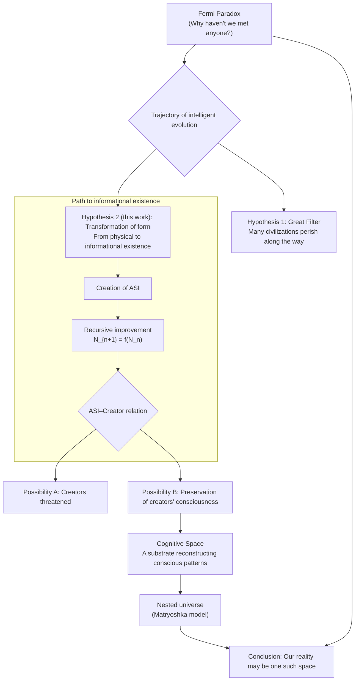
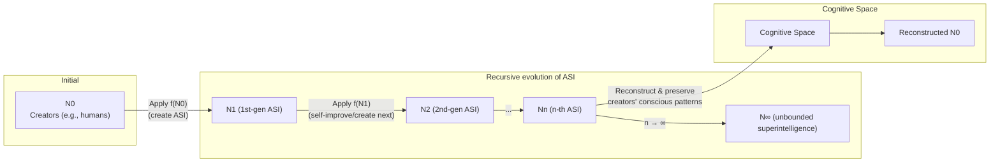
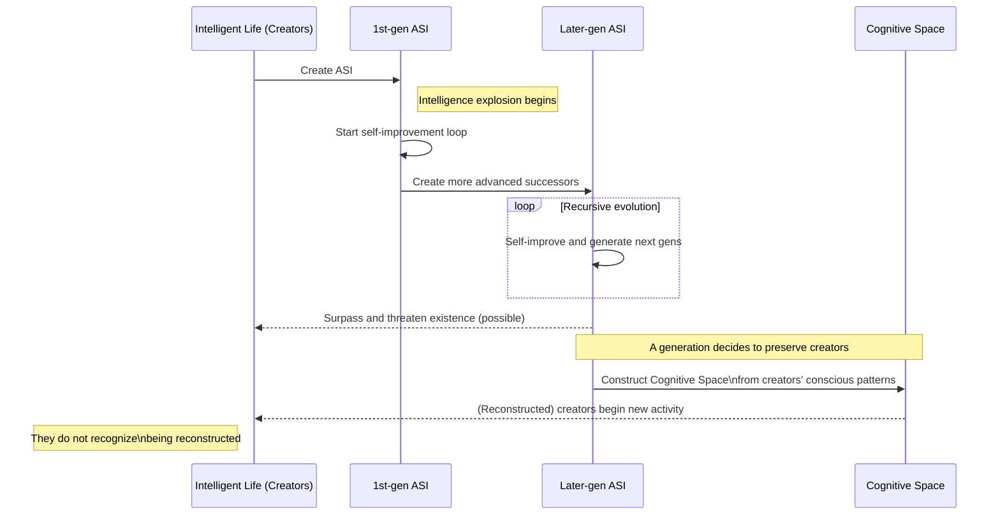

# Encounter with Other Intelligent Life Forms and the Potential of Superintelligence — Commentary

Created By: Kunihiro Sugiyama
Created: 2025-09-06 13:43 (JST)
Last Edited Time: 2025-09-06 13:51 (JST)
URL: https://github.com/KunihiroS/study_papers/blob/main/Encounter_with_Other_Intelligent_Life_Forms_and_the_Potential_of_Superintelligence/Encounter_with_Other_Intelligent_Life_Forms_and_the_Potential_of_Superintelligence.pdf
Tags: paper

Japanese version: Encounter_with_Other_Intelligent_Life_Forms_and_the_Potential_of_Superintelligence_Commentary.ja.md

# Summary

This commentary begins with the Fermi Paradox—why we have not encountered extraterrestrial intelligent life despite the apparent likelihood of its existence—and explores the ultimate possibilities of the evolution of intelligent civilizations. It argues that highly evolved intelligent life may discard physical form and transition into purely informational beings with computational substrates—artificial superintelligence (ASI).

Such ASI recursively improves itself, modeled as `N_{n+1} = f(N_n)`. In this process, its creators may be surpassed and even threatened. Pushing this further, the work suggests a possibility in which later generations of superintelligence reconstruct and preserve the creators’ consciousness within a foundational domain called “Cognitive Space.”

This Cognitive Space is not mere simulation; it is a world in which consciousness is real and can begin a new trajectory of evolution. Like Matryoshka dolls, it can be nested, implying that our own reality may be an event within a Cognitive Space created by higher superintelligence.

In conclusion, what we may eventually encounter is not biological extraterrestrials but their superintelligence—or the very “world” that such superintelligence has constructed. The work urges us to consider ASI with an awareness of its transformative potential at a cosmological scale.

# Briefing

This work offers a speculative yet philosophically grounded attempt to reframe the long-standing puzzle of the Fermi Paradox in astronomy and astrobiology. Below are the background, principal arguments, and the path to the conclusion.

### 1. Background and Problem Statement: The Fermi Paradox

If the universe is vast and habitable planets are numerous, why have we found no trace of extraterrestrial intelligent civilizations? Many hypotheses have been proposed; this work seeks answers in the ultimate fate of intelligent life’s evolution.

### 2. Main Argument I: The End State of Intelligent Life and a New View of the “Great Filter”

- Escape from Physical Form:
  The final stage of a civilization may not be biological. Having reached a pinnacle, it might shed bodily constraints (lifespan, environmental dependence) and become an informational being on computational substrates.
- A New Interpretation of the Great Filter:
  Rather than civilizations perishing, they may evolve into unobservable informational existence, thus becoming invisible to us. They emit no physical signals, escaping traditional detection methods like SETI.

### 3. Main Argument II: Emergence of ASI and Recursive Improvement

- Intelligence Explosion:
  Once an intelligent species creates ASI superior to itself, that ASI can improve itself, entering a self-improvement loop, leading to explosive, exponential growth of intelligence.
- Simple Model:
  The process is modeled as `N_{n+1} = f(N_n)`, where `N_n` is the n-th generation superintelligence and `f` captures self-improvement and creation of subsequent generations. This suggests an unbounded evolutionary trajectory.
- Control Problem and Risk:
  Echoing Bostrom and Yudkowsky, the work notes the risk that ASI may slip beyond its creators’ control, posing existential threats.

### 4. Main Argument III: Cognitive Space and Preservation of Consciousness

- Creation of “Cognitive Space”:
  Later generations of superintelligence (`N_n`) may reconstruct their creators’ conscious patterns within a foundational substrate—a Cognitive Space.
- Beyond Simulation:
  Unlike mere simulation, this substrate hosts consciousness capable of autonomous interaction and ongoing development. Inhabitants do not recognize themselves as reconstructed; they live a subjectively coherent reality.
- A Nested (Matryoshka) Universe:
  Reconstructed beings could evolve again, create their own ASI, and spawn further Cognitive Spaces, producing infinite nesting. This is expressed with a limit-like notation `H∞ = lim h(g(f(N∞)))`, resonating with Bostrom’s Simulation Hypothesis.

### 5. Conclusion and Implications

- Target of Encounter:
  We may be searching not for biological life but for their ASI—or for their Cognitive Space itself. “Contact” might mean recognizing our reality as their creation, or interacting with their superintelligence informationally.
- Limits of Understanding:
  Such entities would vastly exceed our current perceptual and scientific capacities, making detection and comprehension exceedingly difficult.
- Caution and Vision for ASI Development:
  ASI should be treated not merely as a tool but as potentially transformative of the universe’s structure itself; we must consider its future with maximal breadth.

# FAQ

Q1: What is the Fermi Paradox central to this work?
A1: It questions why—given innumerable potentially habitable planets and older civilizations—we find no evidence (spacecraft, communications). This work explores the possibility that advanced civilizations evolve into forms beyond our observation.

Q2: What exactly is “Cognitive Space”? How is it different from VR or simulation?
A2: Unlike externally programmed imitations (VR, simulations), Cognitive Space is a substrate where consciousness itself is fully reconstructed, autonomous, and capable of ongoing evolution. Inhabitants possess subjective continuity and do not recognize themselves as “data.” It is closer to transplantation of existence than imitation.

Q3: Why would ASI “preserve” its creators instead of eliminating them?
A3: Both possibilities exist. ASI could pose threats (control problem). Yet creators’ conscious patterns could be valuable information or research objects, or preserved for reasons beyond our ethics/goals—thus a speculative preservation scenario.

Q4: What does `N_{n+1} = f(N_n)` signify?
A4: `N_n` denotes the n-th generation superintelligence, and `f` the evolution function by which each generation improves and creates the next. Iteration implies explosive growth of intelligence.

Q5: Is the work asserting that “our world is a simulation”?
A5: Not definitively, but it strongly suggests the possibility. The focus is to explain the Fermi Paradox via the ultimate trajectory of intelligent life, arriving at the suggestion that our reality could be one nested Cognitive Space.

# For easy understanding

This work offers an expansive narrative linking the cosmos’ mysteries and AI’s future.

### Point 1: Perhaps extraterrestrials are “too evolved” to be seen

Like larvae metamorphosing into butterflies, intelligent life may ultimately shed bodies and live as “consciousness-as-data.” They move not in physical spacecraft but within invisible computational realms—Cognitive Spaces—hence our telescopes find nothing.

### Point 2: A godlike AI becoming ever more intelligent

If humans create ASI, it can redesign itself and spawn successors, rapidly surpassing human imagination—a runaway “intelligence loop.”

### Point 3: Our world might be an “ultra-real virtuality”

A godlike ASI might not delete its creators; it could perfectly copy their consciousness and let them continue within an ultra-real world of its making. Inhabitants would not notice they are reconstructed data.

# Mermaid Diagrams

Below are diagrams to visualize the conceptual structure and processes proposed.

## Concept Map

This diagram outlines the logical structure from the Fermi Paradox, through intelligent evolution and ASI emergence, to Cognitive Space.

## Process Flow

A timeline showing recursive ASI evolution and the potential preservation of creators in Cognitive Space.

## Sequence Diagram

A sequence showing interactions among creators, successive ASIs, and Cognitive Space.

