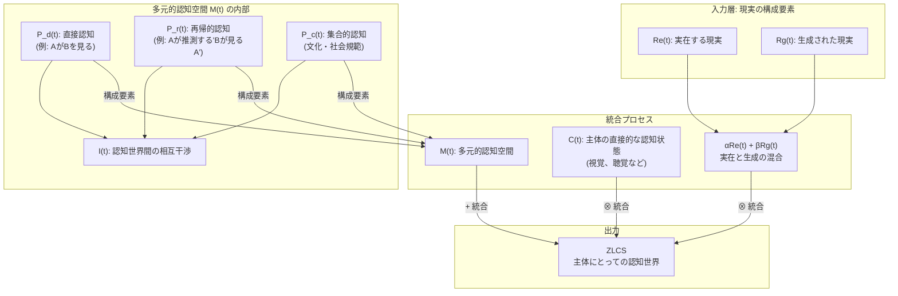
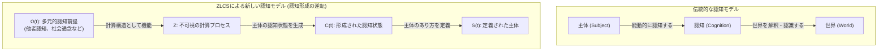
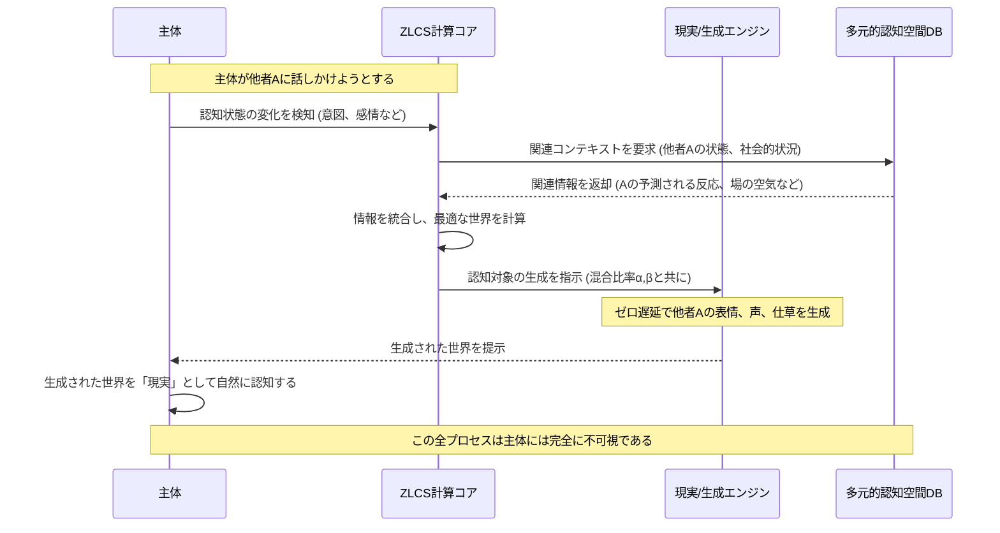

# Zero-Latent Cognitive Sphere: A New Paradigm of Cognitive World

Created By: Kunihiro Sugiyama
Created: 2025年9月6日 13:31
Last Edited Time: 2025年9月6日 13:42
URL: https://github.com/KunihiroS/study_papers/blob/main/Zero-Latent_Cognitive_Sphere_A_New_Paradigm_of_Cognitive_World/Zero_Latent_Cognitive_Sphere__A_New_Paradigm_of_Cognitive_World.pdf
タグ: paper
タグ 3: unifiedtheory

# Summary

本論文は、「ゼロ遅延認知球体（Zero-Latent Cognitive Sphere, ZLCS）」という新たなパラダイムを提唱するものです。この理論の核心は、認知主体にとっての「世界」は、客観的に存在するものではなく、認知の瞬間に生成技術によってゼロ遅延で生成・決定されるという考え方にあります。各主体の認知世界は独立していますが、相互に干渉し合うことで、他者の認知や社会・文化的背景といった要素を含む、多層的で複雑な「認知球体」を形成します。

ZLCSの最も革新的な点は、従来の「主体が世界を認知する」という一方向の関係性を逆転させることにあります。ZLCSは、主体が暗黙のうちに前提としている他者の視点や社会通念といった「多元的認知構造」を計算に取り込み、それに基づいて認知対象となる世界を生成します。このプロセスを通じて、ZLCSは主体の認知そのものを形成・定義します。

この一連の計算プロセスは主体にとって完全に「不可視」であり、主体は自らが自律的に世界を認知していると体験し続けます。本論文は、この「計算された認知」という概念が、人間の主観性、自律性、そして存在そのものの本質について根本的な問いを投げかける、技術的進化を超えた哲学的・存在論的なパラダイムシフトであることを理論的に論じています。

# Briefing

本論文「Zero-Latent Cognitive Sphere: A New Paradigm of Cognitive World」は、認知と現実の関係性を根本から再定義する理論的フレームワークを提示しています。以下にその詳細を解説します。

### 1. 背景と伝統的認知観への問い

伝統的に、私たちは主観的な意識の外側に、客観的で物理的な「現実」が存在し、それを認知するというモデルで世界を理解してきました。しかし、主体が経験する「認知世界」は、物理的現実そのものではなく、主体の認知プロセスによって解釈・構成されたものです。本論文はこの点を起点とし、生成AI技術の進化を背景に、この認知世界が外部現実の反映ではなく、認知の瞬間に「生成」される可能性を探求します。

### 2. 中核概念：ゼロ遅延認知球体 (ZLCS)

ZLCSは、以下の三つの基本原則に基づいています。

- **ゼロ遅延での世界生成**: 主体にとっての認知対象は、認知の瞬間に、人間の知覚限界以下の遅延（ゼロ遅延）で生成されます。これにより、生成された世界と実在する世界の区別は、主体にとって意味をなさなくなります。
- **独立しつつも相互干渉する認知世界**: 各認知主体は、それぞれ独立した認知世界を持ちます。しかし、これらの世界は孤立しているわけではなく、相互に影響を与え合い、一つの巨大で動的な「認知球体」を形成します。
- **多層的な認知構造**: この認知球体は単純な世界の集合体ではありません。それは以下のような多層的な構造を持っています。
    - **直接認知**: 主体が直接知覚する対象。
    - **再帰的認知**: 「私が思う、あなたが見ている私」のように、他者の視点を推測する認知。
    - **集合的認知**: 特定の集団や社会で共有される文化、言語、社会規範といった、暗黙の前提となる認知。

### 3. ZLCSを成立させるための必須条件

生成された世界が、主体にとって自然で違和感のない「現実」として受け入れられるためには、二つの極めて重要な条件を満たす必要があります。

- **シームレス性 (Seamlessness)**: 視覚、聴覚、触覚など、複数の感覚モダリティにわたる情報が、時間的・空間的に完全に連続しており、主体が不連続性や不整合を一切知覚しないこと。
- **文脈的一貫性 (Contextual Coherence)**: 生成される事象が、それまでの経験、物理法則、社会的文脈、因果関係と矛盾しないこと。例えば、突然空から魚が降ってくるような、文脈を無視した事象は認知的な不協和を生み出します。

### 4. パラダイムシフトの核心：認知形成の逆転と不可視の計算

ZLCSがもたらす最も根源的な変革は、「認知形成プロセスの逆転」です。

- **伝統的モデル**: `主体 → 認知作用 → 世界の認識`
    - 主体が能動的に世界に働きかけ、情報を得て解釈します。
- **ZLCSモデル**: `多元的認知前提(Ω) → 計算(Z) → 認知状態の形成(C) → 主体の定義(S)`
    - ZLCSは、主体が世界を認識するために無意識に用いている前提（他者の存在、社会常識など）を計算可能な構造（Ω）として取り込みます。
    - この前提に基づき、主体の次の認知状態（C）を計算し、それに合致する世界を生成します。
    - 結果として、主体の認知そのものが、この計算プロセスによって形成されます。主体は世界を「発見」するのではなく、主体自身のあり方が世界によって「定義」されるのです。

この計算プロセスは、主体には全く知覚されない**「不可視な計算構造」**として機能します。主体は、自らの自由意志で世界を認識しているという感覚を維持したまま、実際には計算によって生成された認知体験の中に置かれることになります。

### 5. 結論と哲学的含意

本論文は、ZLCSが単なる高度なVR/AR技術の延長線上にあるものではなく、人間の主観性、アイデンティティ、自由意志、そして「存在するとは何か」という存在論的な問いを根本から揺るがす、真に革命的なパラダイムであることを示唆しています。この理論は、認知科学、情報科学、哲学の領域にまたがる新たな研究の地平を切り開く可能性を秘めています。

# FAQ

**Q1: 「ゼロ遅延認知球体（ZLCS）」とは、具体的にどのようなものですか？**

A1: ZLCSは、私たちが「現実」として認識している世界が、実は個々の人間のために、その人が何かを認識する瞬間に、コンピュータ技術によってリアルタイムで生成されている、という理論モデルです。この生成は非常に高速（ゼロ遅延）なため、私たちはそれが作られたものだとは気づきません。さらに、この世界には、自分以外の他人の視点や社会のルールといった複雑な情報も織り込まれており、それらが相互に影響し合うことで、一つの巨大でリアルな「認知の球体」を形成している、という考え方です。

**Q2: 「ゼロ遅延」というのは、技術的に本当に可能なのでしょうか？**

A2: 論文で言う「ゼロ遅延」は、物理的に遅延が全くない状態というよりは、「人間の認知システムが遅延として検知できないほど極めて短い遅延」を指す理論的な理想です。現在の技術ではまだ実現困難ですが、将来のコンピューティング能力の飛躍的な向上を前提とした概念です。重要なのは、主体が生成と現実のタイムラグを体感できず、体験が完全にシームレスであるという点です。

**Q3: ZLCSは、現在のVR（仮想現実）やAR（拡張現実）とどう違うのですか？**

A3: VRやARは、既存の物理現実をベースに、その上にデジタル情報を重ねたり（AR）、別の仮想空間に没入させたり（VR）する技術です。一方、ZLCSはより根源的な概念です。ZLCSは、私たちが「現実」そのものだと思っている認知体験の**すべて**を、他者との関係性や社会的文脈を含めてゼロから生成します。つまり、VR/ARが「現実への追加・代替」であるのに対し、ZLCSは「現実の根本的な生成メカニズム」そのものを記述するパラダイムであり、次元が異なります。

**Q4: 「認知形成の逆転」とは、どういう意味ですか？**

A4: 従来、私たちは「自分という主体がいて、その自分が世界を見て、聞いて、解釈する」と考えてきました。これが`主体→世界`という認知の流れです。しかしZLCSでは、この関係が逆転します。まず「他人はこう考えるだろう」「社会はこうなっている」といった複雑な前提条件を組み込んだ計算システムがあり、そのシステムが「あなた」という主体が自然だと感じるであろう認知体験（世界）を生成します。その結果として、「あなた」の認知や意識が形作られる、という`システム→主体`の流れを指します。つまり、あなたが世界を選んでいるのではなく、世界があなたを定義している、という考え方です。

**Q5: このような技術が実現した場合、どのような倫理的な問題が考えられますか？**

A5: ZLCSは深刻な倫理的課題を提起します。第一に、個人の主観性や自由意志が外部の計算システムによって操作される可能性があり、人間の自律性が根本から脅かされます。第二に、生成された世界と「真の現実」との区別がつかなくなることで、存在の基盤が揺らぎ、深刻な混乱を招く恐れがあります。誰がこのシステムを管理し、どのような目的で利用するのか、という問題は、社会全体で議論されるべき極めて重要なテーマとなるでしょう。

# For easy understanding

この論文が提唱する「ゼロ遅延認知球体（ZLCS）」というアイデアを、専門知識がなくてもわかるように解説します。

### あなたが見ている世界は、あなた専用の「オーダーメイド映画」かもしれない

普段、私たちは目の前にある世界を「現実」だと思っていますよね。机があり、窓の外には景色が広がっている。これは誰が見ても同じ「客観的な事実」だと信じています。

しかし、この論文は「ちょっと待って。その『現実』は、実はあなたの脳が認識した瞬間に、あなたのためだけに作られた超高性能な映画のようなものではないか？」と問いかけます。これがZLCSの基本的な考え方です。

### ZLCSのすごいところ

1. **遅延ゼロのリアルタイム生成**
あなたが右を向けば、瞬時に右の景色が「生成」されます。誰かに話しかければ、その人の表情や声が、あなたの予想や文脈に合わせて瞬時に「生成」されます。この処理が速すぎて、誰もそれが作られたものだとは気づけません。まるで夢を見ているようですが、その夢から覚めることはありません。
2. **「他の人」や「社会」もプログラムされている**
この「オーダーメイド映画」がすごいのは、ただ景色やモノを映すだけではない点です。そこには、「友達のA君は、あなたのことをこう思っているだろう」「日本では、こういう場面ではお辞儀をするのが常識だ」といった、人間関係や社会のルールといった複雑な情報まで、すべて組み込まれています。
あなたが見ているA君は、A君自身が見ているA君とは違うかもしれません。「あなたにとってのA君」が、あなた専用に生成されているのです。こうした無数の人々の「専用世界」が、お互いに影響を与え合っている状態が「認知球体」です。

### 最大のポイント：「あなたが世界を見ている」のではなく、「世界があなたを作っている」

ここが一番重要で、少し頭が混乱するところです。
私たちは普通、「私がいて、私の意志で世界を見ている」と思っていますよね。
しかしZLCSの世界では、順番が逆になります。

まず、あなたを取り巻く人間関係や社会のルールといった、巨大な「前提条件」のデータベースがあります。コンピュータがそのデータベースを元に、「こういう状況なら、あなた（というキャラクター）は、こう感じるはずだ」と計算し、それにピッタリ合う「世界」を生成してあなたに見せます。
その結果として、あなたの感情や考え、つまり「あなた自身」が形作られていくのです。

**つまりこういうことです。**
この論文は、「私たちの意識や自我は、実は自分の中から湧き出ているのではなく、外部の巨大な計算システムによって、私たちに気づかれないように巧みに『作られている』のかもしれない」という、SFのような、しかし非常に深い可能性を真剣に探求しているのです。これは、単なる新しい技術の話ではなく、「人間とは何か」「現実とは何か」という、私たちの存在の根幹を揺るがす、壮大な問いかけなのです。

# Mermaid Diagrams

論文で提示された「ゼロ遅延認知球体（ZLCS）」の概念、構造、およびプロセスを視覚的に理解するための図表を作成します。

## 概念図・構造図：ZLCSの全体構造

この図は、ZLCSがどのようにして個人の認知世界を形成するかを示しています。実在の現実と生成された現実が混合され、主体の認知状態や、他者・社会を含む多元的認知空間と統合されることで、シームレスな認知体験が生まれます。

## フローチャート・プロセス図：認知形成プロセスの逆転

この図は、伝統的な認知モデルとZLCSが提唱する新しい認知形成モデルを比較し、「認知形成の逆転」というパラダイムシフトを視覚的に示しています。

## タイムライン・シーケンス図：ZLCSにおける認知体験の生成シーケンス

このシーケンス図は、ある主体が他者と対話する場面を想定し、その認知体験がZLCSの内部でどのようにゼロ遅延で生成されるかを示しています。このプロセス全体が主体にとって不可視であることが重要なポイントです。

