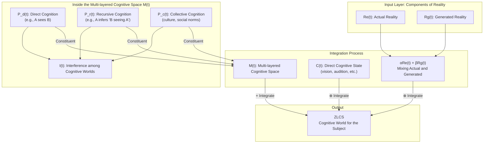
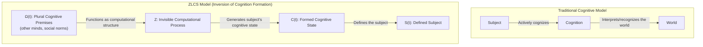
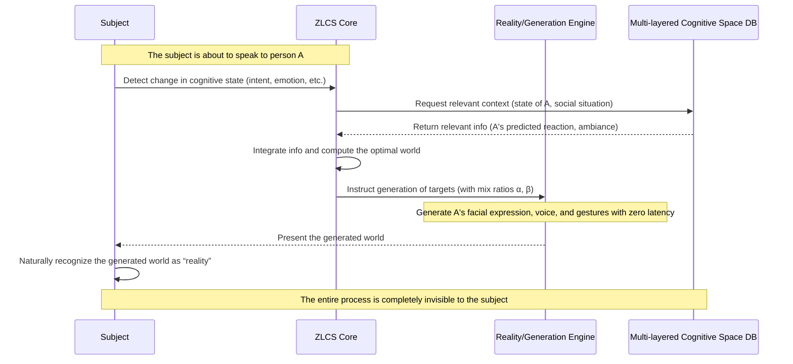

# Zero-Latent Cognitive Sphere Commentary (A New Paradigm of Cognitive World)

Created By: Kunihiro Sugiyama
Created: 2025-09-06 13:31 (JST)
Last Edited Time: 2025-09-06 13:42 (JST)
URL: https://github.com/KunihiroS/study_papers/blob/main/Zero-Latent_Cognitive_Sphere_A_New_Paradigm_of_Cognitive_World/Zero_Latent_Cognitive_Sphere__A_New_Paradigm_of_Cognitive_World.pdf
Tags: paper
Tag 3: unifiedtheory

Japanese version: Zero-Latent_Cognitive_Sphere_Commentary.ja.md

# Summary

This commentary presents a new paradigm called the Zero-Latent Cognitive Sphere (ZLCS). At its core, the paradigm claims that the “world” for a cognitive subject is not an externally given objective entity but is instead generated and fixed with effectively zero latency at the very moment of cognition. Each subject’s cognitive world is independent, yet mutually interfering, forming a multi-layered and complex “cognitive sphere” that incorporates others’ cognition as well as socio-cultural backgrounds.

The key innovation of ZLCS is the inversion of the traditional unidirectional relation “the subject cognizes the world.” ZLCS computationally internalizes a plurality of cognitive premises—such as others’ viewpoints and social norms—and uses them to generate the world that will be taken as the object of cognition. Through this process, ZLCS forms and defines the subject’s cognition itself.

This entire computational process is completely invisible to the subject, who maintains the experience of autonomously cognizing the world. The notion of “computed cognition” thus raises fundamental questions about human subjectivity, autonomy, and the very nature of existence, implying a philosophical and ontological paradigm shift that goes beyond mere technological progress.

# Briefing

“Zero-Latent Cognitive Sphere: A New Paradigm of Cognitive World” provides a theoretical framework that redefines the relationship between cognition and reality from the ground up. Details follow.

### 1. Background and the Question to Traditional Cognition

Traditionally, we have understood the world through a model where an objective, physical “reality” exists outside our subjective consciousness and is then cognized. However, the “cognitive world” experienced by a subject is not the physical reality itself, but something interpreted and constructed by the subject’s cognitive processes. Starting from this point—and against the backdrop of rapid advances in generative AI—this work explores the possibility that the cognitive world is not a reflection of external reality, but is “generated” in the moment of cognition.

### 2. Core Concept: Zero-Latent Cognitive Sphere (ZLCS)

ZLCS rests on three basic principles:

- Strongly real-time world generation (zero latency):
  For the subject, the cognitive target is generated at the moment of cognition with latency below human perceptual thresholds (effectively “zero latency”). As a consequence, the distinction between generated reality and actual reality becomes meaningless for the subject.
- Independent yet mutually interfering cognitive worlds:
  Each cognitive subject has an independent cognitive world. Yet these worlds are not isolated; they influence each other and form a vast, dynamic “cognitive sphere.”
- Multi-layered cognitive structure:
  The cognitive sphere is not a simple collection of worlds; rather, it comprises layers such as:
  - Direct cognition: What the subject directly perceives.
  - Recursive cognition: Inferences of others’ perspectives (e.g., “what I think you see in me”).
  - Collective cognition: Shared culture, language, and social norms that function as implicit premises.

### 3. Necessary Conditions for ZLCS

For the generated world to be accepted by the subject as a natural, seamless “reality,” two crucial conditions must be satisfied:

- Seamlessness:
  Information across multiple sensory modalities (vision, audition, touch, etc.) must be temporally and spatially continuous so that the subject perceives no discontinuity or inconsistency.
- Contextual coherence:
  Generated events must not contradict prior experience, physical laws, social contexts, or causal relations. Context-free anomalies (e.g., fish suddenly raining from the sky) would trigger cognitive dissonance.

### 4. Core of the Paradigm Shift: Inversion of Cognition Formation and Invisible Computation

ZLCS fundamentally inverts the process of cognition formation.

- Traditional model: subject → cognitive act → recognition of the world
  - The subject actively interacts with the world to obtain and interpret information.
- ZLCS model: plural cognitive premises (Ω) → computation (Z) → formation of cognitive state (C) → definition of the subject (S)
  - ZLCS internalizes, as a computational structure (Ω), the premises implicitly used by subjects to recognize the world (e.g., the existence of others, social common sense).
  - Based on these premises, it computes the subject’s next cognitive state (C) and generates a world consistent with it.
  - Consequently, the subject’s cognition itself is formed by this computational process. The subject does not “discover” the world; rather, the subject’s very mode of being is “defined” by the world thus generated.

This computational process functions as an invisible structure to the subject. While maintaining the experience of freely perceiving the world, the subject is, in fact, situated within a cognitively generated experience.

### 5. Conclusion and Philosophical Implications

ZLCS is not merely an extension of advanced VR/AR technologies; it suggests a truly revolutionary paradigm that shakes the foundations of human subjectivity, identity, free will, and the ontological question of “what it means to exist.” It opens a new horizon spanning cognitive science, information science, and philosophy.

# FAQ

**Q1: What exactly is the Zero-Latent Cognitive Sphere (ZLCS)?**

A1: ZLCS is a theoretical model that posits the world we recognize as “reality” is in fact generated in real time for each individual at the very moment they recognize something. The generation is so fast (zero latency in human terms) that we cannot notice it is being constructed. Moreover, the world also incorporates complex information such as others’ viewpoints and social rules. Through mutual interference among these elements, an enormous, realistic “cognitive sphere” is formed.

**Q2: Is “zero latency” really feasible from a technical standpoint?**

A2: Here, “zero latency” refers not to literally zero physical delay, but to an ideal region of delay so short that the human cognitive system cannot detect it. While current technology cannot yet achieve this, the concept presupposes a dramatic increase in future computational capabilities. The crucial point is that the subject cannot feel any lag between generation and experience, i.e., the experience is perfectly seamless.

**Q3: How is ZLCS different from VR (Virtual Reality) or AR (Augmented Reality)?**

A3: VR/AR rely on physical reality—either superimposing digital information upon it (AR) or immersing the user in an alternative space (VR). ZLCS is more fundamental: it describes the mechanism for generating the entirety of the cognitive experience we take as “reality,” including relations with others and social contexts. In short, while VR/AR add to or substitute reality, ZLCS theorizes the generative mechanism of reality itself.

**Q4: What does the “inversion of cognition formation” mean?**

A4: Conventionally, we think there is a “self” who sees, hears, and interprets the world—i.e., cognition flows from subject to world. In ZLCS, this relation is inverted. A computational system first integrates complex premises (e.g., “others would likely think this,” “society is arranged like that”), and then generates the cognitive experience (world) that the subject would naturally feel. As a result, the subject’s cognition and even consciousness are shaped—cognition flows from system to subject. In other words, the world defines you, rather than you selecting the world.

**Q5: What ethical issues could arise if such a technology were realized?**

A5: ZLCS raises serious ethical challenges. First, personal subjectivity and free will could be manipulated by an external computational system, fundamentally threatening human autonomy. Second, the boundary between generated reality and “true reality” could become indiscernible, shaking the basis of existence and potentially causing profound confusion. Who controls such a system and for what purposes would become a critical topic of societal debate.

# For easy understanding

This section explains ZLCS in accessible terms without requiring specialized background.

### The world you see might be your “custom-made movie”

We normally take the world before us as “reality.” There is a desk, and a view outside the window. We believe these are the same objective facts for anyone.

This work asks: what if that “reality” is actually like an ultra-high-performance film generated just for you at the very moment your brain recognizes it? That is the basic idea of ZLCS.

### What is striking about ZLCS

1. Zero-latency real-time generation
   If you turn your head to the right, the right-side scene is generated instantly. If you speak to someone, their facial expressions and voice are generated instantly in line with your expectations and the context. The processing is so fast no one can tell it is being constructed. It is like dreaming, except you never wake up from it.
2. “Others” and “society” are also programmed
   This custom-made movie does not merely render scenes or objects. It also integrates complex information such as “Friend A probably thinks this about you” or “In Japan, bowing is customary in such situations.” The A you see may differ from the A that A sees. The “A-for-you” is generated for you. The state in which innumerable personal worlds mutually influence each other is the “cognitive sphere.”

### The crucial point: it is not “you see the world,” but “the world makes you”

This is the most important—and somewhat mind-bending—point. We normally think, “I exist, and by my will I see the world.” In ZLCS, the order is reversed.

First there is a vast database of premises—human relations around you, social rules, etc. Based on it, a computational system calculates “in this situation, you (as a character) would feel such-and-such,” and then generates the “world” that perfectly matches it, presenting it to you. As a result, your feelings and thoughts—“you yourself”—are shaped.

In short: our consciousness and self might not spring from within, but might be subtly “constructed” by an external, massive computational system without our noticing. This is not merely about a new technology; it is a grand question that shakes the foundations of what “human” and “reality” mean.

# Mermaid Diagrams

To visualize the concept, structure, and processes of ZLCS, we provide the following diagrams.

## Concept and Structure: Overall Architecture of ZLCS

This diagram shows how ZLCS forms an individual’s cognitive world. Actual reality and generated reality are mixed and integrated with the subject’s cognitive state and the multi-layered cognitive space (including others and society), yielding a seamless cognitive experience.

## Process Flow: Inversion of Cognition Formation

This diagram contrasts the traditional cognitive model with the new formation model proposed by ZLCS, visually highlighting the “inversion of cognition formation.”

## Sequence Timeline: Generation of a Cognitive Experience in ZLCS

This sequence diagram illustrates how a cognitive experience is generated with effectively zero latency when a subject engages in a dialogue with another person. The entire process remains invisible to the subject.

